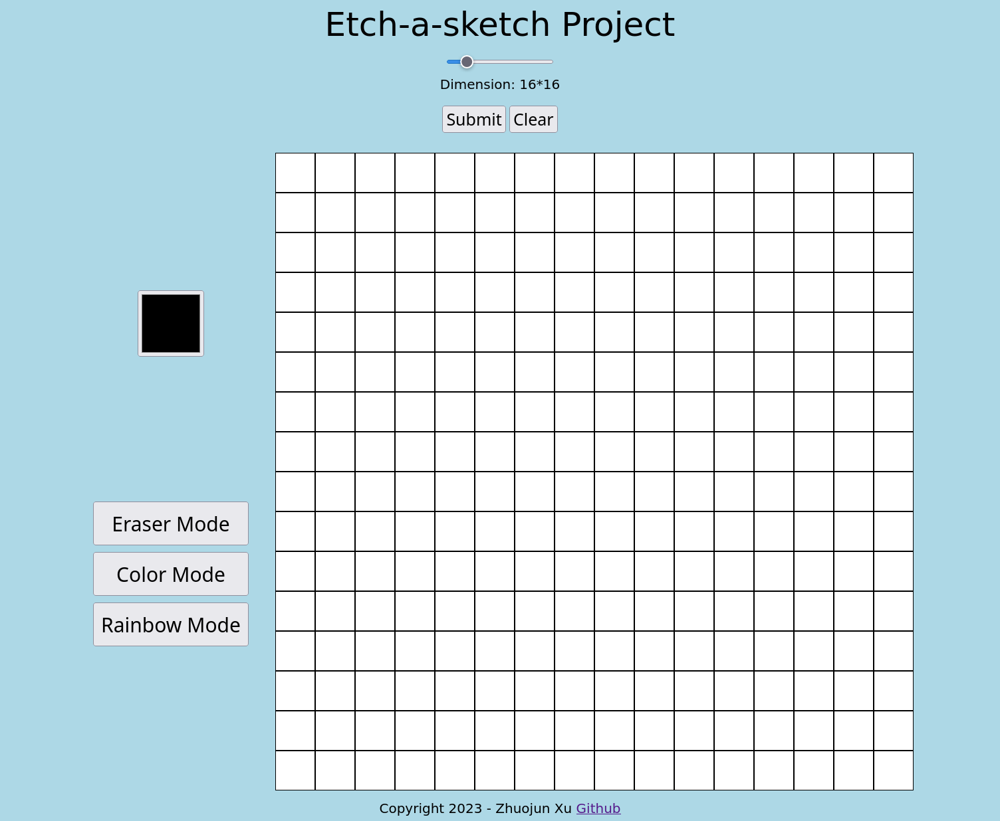

# Etch-a-Sketch
Below is the screenshot of the game.

How to play the game?
1. By Default, the game will be in black mode. Please click the black square to change the color.
2. If choosing to Eraser Mode after coloring each grid will apply back to white color. 
3. To clear all of the grid colors, press clear button.
4. To change the dimension, please use the scroller to change the number of grids divided.

What to improve on?
1. Consider using the grid method instead of flexbox to do the grid.
2. Improve the mouse scrolling when drawing into grid. 
3. Adding Responsive web design. 